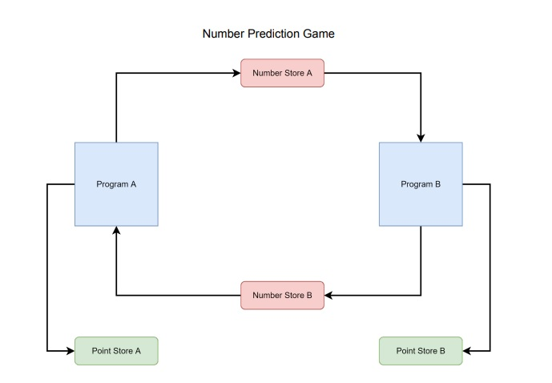

# py-rabbitmq-numbergame
It is a game that includes a queuing mechanism and passes between two python files.

 

## Abstract

This project is written in the pika library, which is an auxiliary library in the python programming language for RabbitMQ.

ProgramA and ProgramB work independently of each other and send 1 random numbers to each other with the help of RabbitMQ. 
Both programs generate 5 random numbers to know the number from send the by rival program.
If they know the number sent by the rival program, they send points to the queue created for points.

 

After installing the RabbitMQ server and python requirements, you can run both scripts separately and observe the application.

`python ProgramA.py`

`python ProgramB.py`

